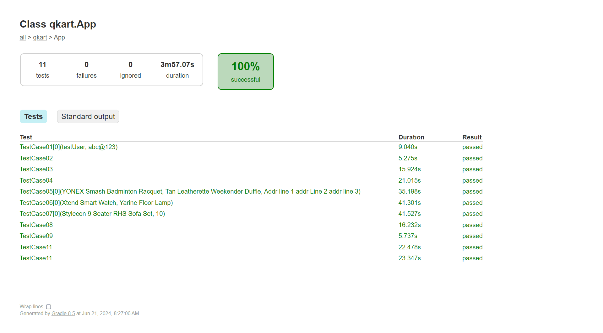

# QKart

`Java` `Selenium` `Locators` `HTML` `Developer Tools` `Window Handling` `Screenshots` `Selenium Waits` `XPath` `TestNG`

---

The application under test is [QKart](https://crio-qkart-frontend-qa.vercel.app), an e-commerce platform.

---

During the course of this project:

* Debugged failing test cases and issues with log statements.
* Automated testing with selenium.
* Utilized implicit and explicit waits correctly to avoid synchronization issues.
* Improved the tests with XPath.
* Migrated tests to the TestNG test automation framework.

---

# Overview
The application under test is [QKart](https://crio-qkart-frontend-qa.vercel.app), an e-commerce platform.

During the course of this project:
* Debugged failing test cases and issues with log statements.
* Automated testing with selenium.
* Utilized implicit and explicit waits correctly to avoid synchronization issues.
* Improved the tests with XPath.
* Migrated tests to the TestNG test automation framework.

---

# Modularize test code and debug issues
## Scope of work
* Modularized existing test code for readability and to avoid code duplication.
* Fixed various bugs present in the existing code base for Register and Login pages.
* Used IDE debugger with breakpoints to find and resolve issues faster.

## Skills used
`Java` `Selenium` `Locators` `HTML` `Developer Tools`

---

# Automate given manual test cases
## Scope of Work
* Implemented automated tests for functionalities like product search, editing user cart items, cart content persistence across sessions.
* Added log statements appropriately to aid in debugging any issues.
* Reused methods like searching for products, and add items to the cart thus making the code more maintainable.

## Skills used
`Java` `Selenium` `Locators` `HTML` `Developer Tools`

---

# Enhance reliability of the automation code by using implicit and explicit waits correctly
## Scope of Work
* Placed appropriate wait statements in the code base to improve script synchronization.
* Implemented feature request to take screenshots before and after the test case and also capture screenshots in case of error.
* Performed automation tests/validations that span across different browser tabs and windows.

## Skills used
`Java` `Selenium` `Locators` `HTML` `Developer Tools`

---

# Making the automation code more resilient with XPath
## Scope of Work
* Fixed a bugs in the existing codebase as a result of incorrect locators by replacing them with XPath.
* Improved code by replacing existing locators with Dynamic XPath.

## Skills used
`Java` `Selenium` `Locators` `HTML` `Developer Tools` `XPath`

---

# Using TestNG to enable features like grouping, prioritizing, and parameterize of tests
## Scope of Work
* Migrated existing Selenium test code to use the TestNG framework.
* Parameterized the test cases and used XML configuration to send the parameters dynamically.
* Created sanity and regression test groups.
* Utilized Test Listeners to take screenshots on different events.

## Skills used
`Java` `Selenium` `Locators` `HTML` `Developer Tools` `XPath` `TestNG`

---

# Screenshots
## Application

> qkart home page

> qkart login page

> qkart register page

> qkart User logged in page

> qkart products in cart page

> qkart checkout page

> qkart thanks page

## Reports
### Emailable report

> qkart emailable report

### Index report

> qkart index report